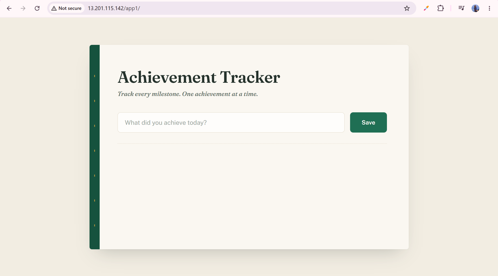
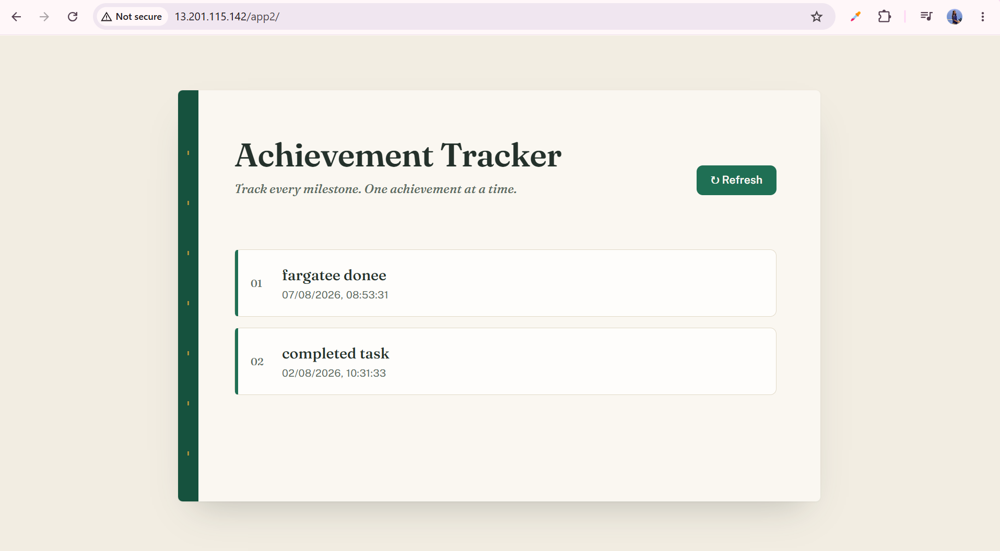
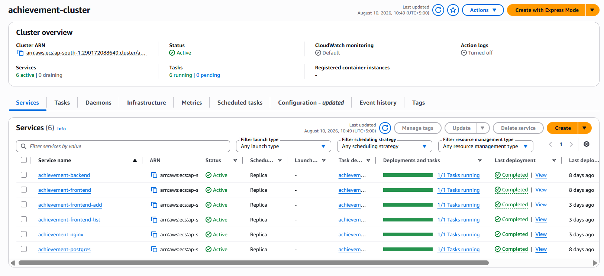
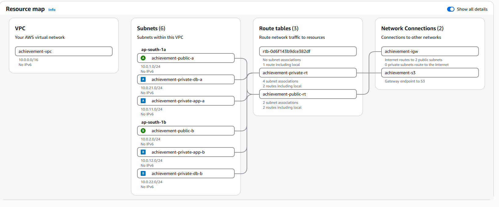
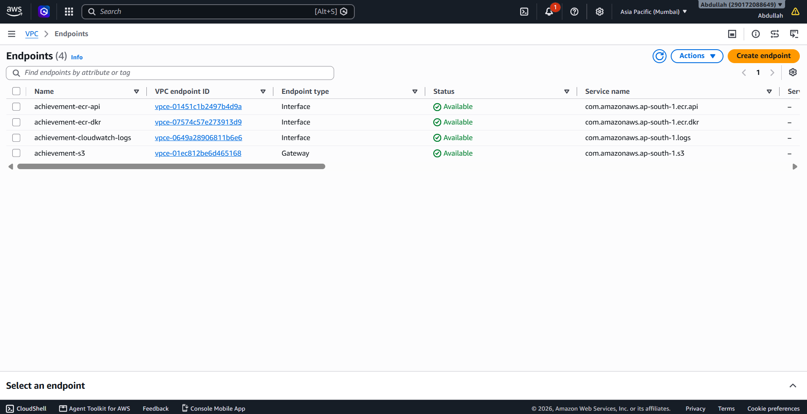
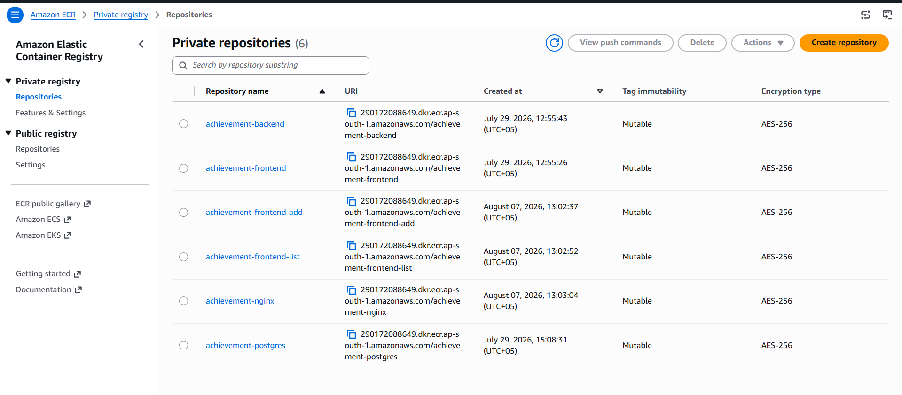
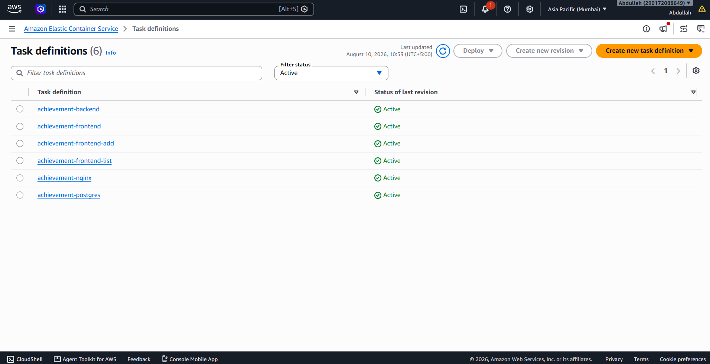
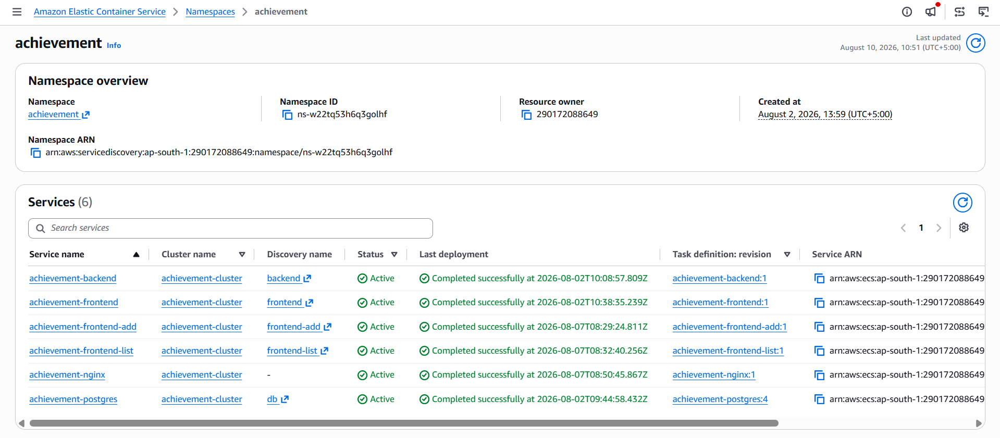
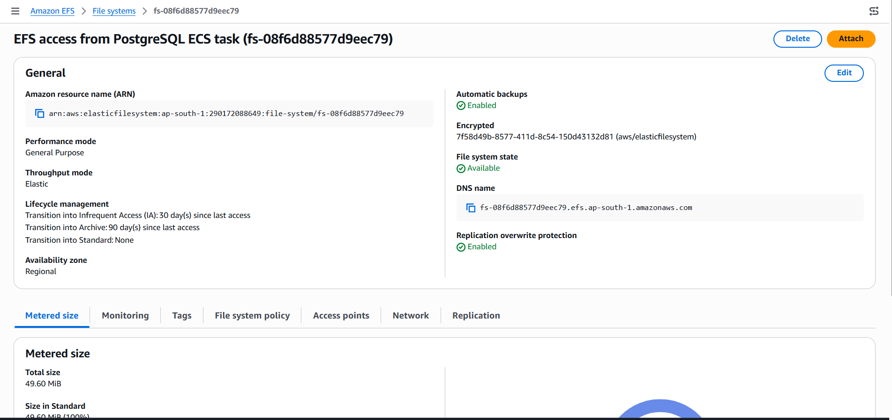
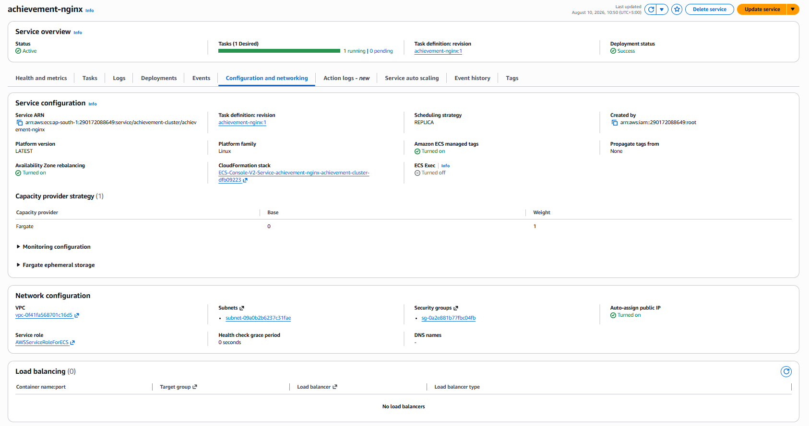

# Achievement Tracker — AWS ECS Fargate Deployment

A containerized **Achievement Tracker** application deployed on **Amazon ECS using AWS Fargate**, featuring two independent React frontends, a FastAPI backend, PostgreSQL, Nginx reverse proxy, ECS Service Connect, Amazon EFS persistence, Amazon ECR, private networking, and **context-based routing without an Application Load Balancer (ALB)**.

---

## Table of Contents

* [Overview](#overview)
* [Project Objective](#project-objective)
* [Architecture](#architecture)
* [Application Architecture](#application-architecture)
* [Container Architecture](#container-architecture)
* [Technology Stack](#technology-stack)
* [Repository Structure](#repository-structure)
* [Application Components](#application-components)
* [Docker Implementation](#docker-implementation)
* [AWS Infrastructure](#aws-infrastructure)

  * [VPC and Networking](#vpc-and-networking)
  * [Security Groups](#security-groups)
  * [VPC Endpoints](#vpc-endpoints)
  * [Amazon ECR](#amazon-ecr)
  * [Amazon ECS and Fargate](#amazon-ecs-and-fargate)
  * [ECS Service Connect](#ecs-service-connect)
  * [Amazon EFS](#amazon-efs)
* [Nginx Context-Based Routing](#nginx-context-based-routing)
* [Request Flow](#request-flow)
* [Deployment Approach](#deployment-approach)
* [Verification and Testing](#verification-and-testing)
* [Screenshots](#screenshots)
* [Key Design Decisions](#key-design-decisions)
* [Challenges and Solutions](#challenges-and-solutions)
* [Security Considerations](#security-considerations)
* [What This Project Demonstrates](#what-this-project-demonstrates)
* [Future Improvements](#future-improvements)
* [Conclusion](#conclusion)

---

# Overview

The **Achievement Tracker** is a containerized web application designed to demonstrate practical Docker, networking, and AWS container orchestration concepts.

The project was developed incrementally, starting with a Docker-based application and then moving the workload to **Amazon ECS Fargate**.

The final architecture consists of **five containers/services**:

1. **Nginx** — public reverse proxy and context-based router
2. **Frontend Add** — React application for adding achievements
3. **Frontend List** — React application for viewing achievements
4. **Backend** — FastAPI REST API
5. **PostgreSQL** — relational database

The application is deployed on ECS Fargate **without an Application Load Balancer**. Instead, Nginx acts as the public entry point and performs path-based routing.

---

# Project Objective

The primary objective was to take a multi-container Docker application and deploy it as a cloud-native container workload using **Amazon ECS with AWS Fargate**.

The project specifically demonstrates:

* Containerization with Docker
* Docker Compose-based local orchestration
* Multiple independent frontend applications
* FastAPI backend development
* PostgreSQL database deployment
* Nginx reverse proxy configuration
* AWS ECS Fargate
* Amazon ECR
* ECS Service Connect
* Amazon EFS
* VPC networking
* Private subnets
* Security Groups
* VPC endpoints
* Context/path-based routing
* Persistent database storage
* Deployment without an ALB

A key requirement was to preserve the routing concept from the Docker environment while moving the application to ECS Fargate.

---

# Architecture

The complete AWS architecture is documented in the included architecture diagram:

**[`docs/architecture.html`](docs/architecture.html)**

The architecture can be viewed directly from the repository by opening the HTML file in a browser.

The high-level architecture is:

```text
                         Internet
                            │
                            │ HTTP :80
                            ▼
                 ┌─────────────────────┐
                 │    Nginx Fargate    │
                 │   Public Subnet     │
                 │       Port 80       │
                 └──────────┬──────────┘
                            │
                  Path-Based Routing
                            │
             ┌──────────────┼──────────────┐
             │              │              │
          /app1/         /app2/          /api/
             │              │              │
             ▼              ▼              ▼
     ┌──────────────┐ ┌──────────────┐ ┌──────────────┐
     │ Frontend Add │ │ Frontend List│ │    Backend   │
     │    React     │ │    React     │ │   FastAPI    │
     │    :80       │ │    :80       │ │    :8000     │
     └──────────────┘ └──────────────┘ └───────┬──────┘
                                               │
                                               │ :5432
                                               ▼
                                        ┌──────────────┐
                                        │  PostgreSQL  │
                                        │    :5432     │
                                        └───────┬──────┘
                                                │
                                                │ Persistent Storage
                                                ▼
                                          ┌───────────┐
                                          │    EFS    │
                                          └───────────┘
```


---

# Application Architecture

The application is split into independent components.

```text
                     Achievement Tracker
                             │
            ┌────────────────┼────────────────┐
            │                │                │
            ▼                ▼                ▼
      Frontend Add     Frontend List       Backend
         React             React           FastAPI
            │                │                │
            └────────────────┴────────────────┘
                             │
                             ▼
                         PostgreSQL
```

## Frontend Add

The first frontend provides the interface for adding new achievements.

It is available through:

```text
/app1/
```

The frontend is built using React/Vite and served through Nginx.

Screenshot:



---

## Frontend List

The second frontend provides the interface for viewing stored achievements.

It is available through:

```text
/app2/
```

Screenshot:



---

## Backend

The backend is implemented using **FastAPI**.

It provides the API consumed by the frontend applications.

The backend exposes port:

```text
8000
```

The primary API context is:

```text
/api/
```

For example:

```text
GET /api/achievements
```

The backend communicates internally with PostgreSQL over:

```text
5432
```

---

## PostgreSQL

PostgreSQL provides persistent relational storage for the application.

The database runs as an ECS Fargate workload and uses Amazon EFS for persistent storage.

---

## Nginx

Nginx is the public-facing component of the application.

It:

* Receives HTTP traffic on port 80
* Routes requests based on URL context
* Sends frontend requests to the appropriate frontend service
* Sends API requests to the FastAPI backend
* Acts as the reverse proxy
* Removes the need for an ALB for this deployment

---

# Container Architecture

The final deployment consists of five application containers/services:

| Component     | Technology           | Port | Purpose                          |
| ------------- | -------------------- | ---: | -------------------------------- |
| Nginx         | Nginx Alpine         |   80 | Public reverse proxy and routing |
| Frontend Add  | React + Vite + Nginx |   80 | Add achievements                 |
| Frontend List | React + Vite + Nginx |   80 | Display achievements             |
| Backend       | FastAPI              | 8000 | REST API                         |
| Database      | PostgreSQL 16        | 5432 | Persistent data storage          |

The ECS cluster and deployed services are shown in:



---

# Technology Stack

## Application

* React
* Vite
* Axios
* FastAPI
* SQLAlchemy
* PostgreSQL

## Containerization

* Docker
* Docker Compose
* Docker multi-stage builds
* Nginx

## AWS

* Amazon ECS
* AWS Fargate
* Amazon ECR
* Amazon EFS
* Amazon VPC
* Security Groups
* VPC Endpoints
* ECS Service Connect
* CloudWatch Logs

---

# Application Components

## Frontend Add

The Add frontend is a standalone React application.

Its Vite configuration uses:

```text
/app1/
```

as its base path.

The frontend communicates with the backend through:

```text
/app1/api/
```

---

## Frontend List

The List frontend is a separate React application.

Its Vite configuration uses:

```text
/app2/
```

as its base path.

The frontend communicates with the backend through:

```text
/app2/api/
```

---

## Backend API

The FastAPI backend provides the application API.

The API is exposed through Nginx using:

```text
/api/
```

The backend communicates with PostgreSQL internally.

---

# Docker Implementation

Before deploying to AWS, the complete application was tested as a multi-container Docker Compose application.

The local architecture consisted of:

```text
Docker Compose
│
├── nginx
├── frontend-add
├── frontend-list
├── backend
└── db
```

Docker Compose provided the local service network and allowed the individual containers to communicate using service names.

For example:

```text
frontend-add
frontend-list
backend
db
```

The Docker implementation served as the foundation for the ECS deployment.

---

# Docker Multi-Stage Builds

The React frontends use multi-stage Dockerfiles.

The first stage uses Node.js to build the React application.

The second stage uses Nginx to serve the generated production assets.

Conceptually:

```text
Node.js
   │
   ├── Install dependencies
   ├── Copy source
   └── npm run build
           │
           ▼
       /dist
           │
           ▼
       Nginx Alpine
           │
           ▼
      Production image
```

This keeps the production image focused on serving the compiled application rather than requiring Node.js at runtime.

---

# AWS Infrastructure

## VPC and Networking

The application is deployed inside a dedicated VPC.

The infrastructure includes public and private subnet resources.

The VPC design separates:

* Public entry-point resources
* Application services
* Database resources
* AWS service connectivity

The VPC resource map is shown below:



This separation allows internal services to remain private while exposing only the Nginx entry point.

---

# Security Groups

Security Groups are used to control traffic between the different layers.

The architecture follows a layered communication model:

```text
Internet
   │
   ▼
Nginx
   │
   ├── Frontend Add
   ├── Frontend List
   └── Backend
          │
          ▼
       PostgreSQL
          │
          ▼
          EFS
```

The application services are not exposed directly to the public internet.

The Nginx service is the public entry point.

---

# VPC Endpoints

Because several ECS tasks operate in private networking, AWS service access is provided through VPC endpoints.

The environment uses endpoints for services including:

* Amazon ECR API
* Amazon ECR Docker Registry
* CloudWatch Logs
* Amazon S3

The configured endpoints are shown here:



This allows ECS workloads to communicate with required AWS services without relying on public internet access for those service interactions.

---

# Amazon ECR

The application container images are stored in **Amazon Elastic Container Registry (ECR)**.

The deployment uses separate repositories for the major application components:

```text
achievement-backend
achievement-frontend-add
achievement-frontend-list
achievement-nginx
achievement-postgres
```

The repositories are shown here:



The general image flow is:

```text
Docker Build
     │
     ▼
Local Docker Image
     │
     ▼
Amazon ECR
     │
     ▼
ECS Fargate
     │
     ▼
Running Container
```

---

# Amazon ECS and Fargate

The application is deployed using **Amazon ECS with AWS Fargate**.

Fargate removes the need to provision or manage EC2 instances for the ECS workloads.

The ECS cluster contains separate services for:

```text
achievement-nginx
achievement-frontend-add
achievement-frontend-list
achievement-backend
achievement-postgres
```

The cluster and service configuration are shown here:


---

# ECS Task Definitions

Each workload has its own ECS task definition configuration.

The task definitions define details such as:

* Container image
* CPU
* Memory
* Port mappings
* Environment variables
* Network configuration
* Logging
* Volumes where required

The deployed task definitions are shown here:



The architecture uses the `awsvpc` networking mode so ECS tasks receive their own network interfaces and private IP addresses.

---

# ECS Service Connect

ECS Service Connect is used for internal service-to-service communication.

The ECS environment uses a Service Connect namespace:

```text
achievement
```

The namespace and service discovery configuration are shown here:



Services can communicate using logical service names rather than hardcoded task IP addresses.

For example:

```text
backend:8000
db:5432
```

This is particularly important in Fargate because task IP addresses are not static.

The internal communication model is:

```text
Nginx
   │
   ├── frontend-add
   ├── frontend-list
   └── backend:8000
                    │
                    ▼
                  db:5432
```

Service Connect therefore provides a service-oriented communication layer between the ECS workloads.

---

# Amazon EFS

PostgreSQL uses **Amazon Elastic File System (EFS)** for persistent storage.

This separates the database's persistent data from the lifecycle of the Fargate task itself.

The EFS configuration is shown here:



The database architecture can be represented as:

```text
PostgreSQL Fargate Task
        │
        │ EFS Mount
        ▼
Amazon EFS
        │
        ▼
Persistent Database Data
```

The EFS configuration includes an access point for the PostgreSQL workload.

This ensures that the database's storage is not dependent solely on the ephemeral filesystem of a Fargate task.

---

# Nginx Context-Based Routing

One of the main requirements of the deployment was to perform routing **without an Application Load Balancer**.

Nginx is therefore deployed as the public entry point.

The routing is based on URL paths.

## Routing Table

| Request Path | Destination     |
| ------------ | --------------- |
| `/app1/`     | Frontend Add    |
| `/app2/`     | Frontend List   |
| `/api/`      | FastAPI Backend |

Conceptually:

```text
                    Nginx :80
                        │
          ┌─────────────┼─────────────┐
          │             │             │
       /app1/         /app2/         /api/
          │             │             │
          ▼             ▼             ▼
    frontend-add   frontend-list   backend:8000
```

---

# Why Two Frontends?

The project deliberately separates the frontend functionality into two independent React applications:

### Frontend Add

Responsible for creating achievements.

```text
/app1/
```

### Frontend List

Responsible for displaying achievements.

```text
/app2/
```

This demonstrates that multiple independent frontend services can be deployed and routed through a single public Nginx entry point.

---

# Why Nginx Instead of an ALB?

The deployment requirement was to implement the architecture **without using an Application Load Balancer**.

Instead of:

```text
Internet
   ↓
ALB
   ↓
ECS services
```

the architecture uses:

```text
Internet
   ↓
Nginx Fargate
   ↓
ECS services
```

Nginx handles the application-level path routing:

```text
/app1/
/app2/
/api/
```

This also allowed the existing Docker Compose Nginx routing configuration to be reused conceptually when moving the application to ECS.

---

# Nginx Service

The Nginx ECS service is the only application component intended to receive public traffic.

It is deployed in a public subnet and provides the public HTTP entry point.

The service configuration is shown here:



The remaining application services communicate internally through ECS networking and Service Connect.

---

# Request Flow

## Frontend Add Request

When a user accesses:

```text
/app1/
```

the request follows:

```text
Browser
   │
   ▼
Nginx Fargate
   │
   │ /app1/
   ▼
Frontend Add
```

---

## Frontend List Request

When a user accesses:

```text
/app2/
```

the request follows:

```text
Browser
   │
   ▼
Nginx Fargate
   │
   │ /app2/
   ▼
Frontend List
```

---

## API Request

When an API request is made:

```text
/api/achievements
```

the request follows:

```text
Browser
   │
   ▼
Nginx
   │
   │ /api/
   ▼
Backend :8000
   │
   │ PostgreSQL :5432
   ▼
PostgreSQL
```

---

# End-to-End Data Flow

For example, when a user adds an achievement:

```text
User
 │
 ▼
/app1/
 │
 ▼
Nginx
 │
 ▼
Frontend Add
 │
 │ POST /app1/api/achievements
 ▼
Nginx
 │
 ▼
Backend
 │
 ▼
PostgreSQL
 │
 ▼
EFS
```

When the list frontend retrieves achievements:

```text
User
 │
 ▼
/app2/
 │
 ▼
Frontend List
 │
 │ GET /app2/api/achievements
 ▼
Nginx
 │
 ▼
Backend
 │
 ▼
PostgreSQL
 │
 ▼
Response
 │
 ▼
Frontend List
```

---

# Deployment Approach

The deployment evolved from a local Docker environment into an AWS-managed container environment.

## Stage 1 — Docker Containerization

The application was divided into:

```text
Frontend Add
Frontend List
Backend
PostgreSQL
Nginx
```

and orchestrated locally using Docker Compose.

---

## Stage 2 — Container Images

Each application component was built into a Docker image.

The images were tagged for Amazon ECR.

---

## Stage 3 — Amazon ECR

The container images were pushed to private ECR repositories.

```text
Docker
   │
   ▼
ECR repositories
```

---

## Stage 4 — ECS Task Definitions

Task definitions were created for the individual workloads.

These specify the container images, resource allocations, ports, networking, environment configuration, logging, and storage requirements.

---

## Stage 5 — ECS Fargate Services

The task definitions were deployed as ECS services.

The final ECS environment contains:

```text
5 ECS services
```

corresponding to the five application components.

---

## Stage 6 — Service Connect

Service Connect was configured to allow ECS workloads to communicate using service names.

This removed the need to manually manage changing Fargate task IP addresses.

---

## Stage 7 — Nginx Public Entry Point

Nginx was deployed as a Fargate task in the public subnet.

It receives public HTTP traffic and routes requests according to the URL context.

---

# Verification and Testing

After deployment, the application was tested through the Nginx public endpoint.

## Frontend Add

```bash
curl -i http://<NGINX_PUBLIC_IP>/app1/
```

Expected result:

```text
HTTP/1.1 200 OK
```

---

## Frontend List

```bash
curl -i http://<NGINX_PUBLIC_IP>/app2/
```

Expected result:

```text
HTTP/1.1 200 OK
```

---

## Backend API

```bash
curl -i http://<NGINX_PUBLIC_IP>/api/achievements
```

The API successfully returned achievement data from PostgreSQL.

Example response:

```json
[
  {
    "id": 1,
    "title": "completed task",
    "created_at": "2026-08-02T10:31:33.817945"
  }
]
```

These tests verify that Nginx successfully routes requests to the correct internal ECS services.

---

# Screenshots

The project includes screenshots documenting the AWS infrastructure and application deployment.

## Application

### Add Achievement


The Add frontend is accessible through the `/app1/` context.

### Achievement List


The List frontend is accessible through the `/app2/` context.

---

## ECS Cluster and Services


Shows the deployed ECS cluster and its application services.

---

## Nginx Service


Shows the Nginx Fargate service that acts as the public application entry point.

---

## ECS Task Definitions


Shows the task definitions used to configure the deployed containers.

---

## Amazon ECR


Shows the private ECR repositories containing the container images.

---

## ECS Service Connect Namespace


Shows the ECS Service Connect namespace used for internal service communication.

---

## Amazon EFS


Shows the EFS storage configuration used by PostgreSQL.

---

## VPC Endpoints


Shows the VPC endpoints used to provide private AWS service connectivity.

---

## VPC Resource Map


Shows the VPC resources and network topology.

---

# Key Design Decisions

## 1. ECS Fargate Instead of EC2

Fargate was selected so that the container workloads could run without managing ECS worker instances.

This allows the project to focus on:

* Containers
* Task definitions
* Services
* Networking
* Service discovery
* Application architecture

rather than EC2 host management.

---

## 2. Nginx Instead of ALB

An ALB was intentionally not used because the deployment requirement was to implement context-based routing without an Application Load Balancer.

Nginx provides the routing layer:

```text
/app1/
/app2/
/api/
```

---

## 3. Separate Frontends

The original application concept was expanded into two independent frontend services.

This demonstrates how different application interfaces can be independently containerized and deployed.

---

## 4. ECS Service Connect

Service Connect was used instead of relying on static private IP addresses.

Fargate tasks can be replaced or recreated, so directly depending on task IP addresses would not be a robust design.

Service Connect allows applications to use logical service names.

---

## 5. EFS for Database Persistence

EFS was used to provide persistent storage for PostgreSQL.

This means database storage is separated from the ephemeral lifecycle of the Fargate task.

---

## 6. Private Application Services

The application and database services do not need to be publicly exposed.

Nginx acts as the public entry point, while internal services communicate using private networking.

---

# Security Considerations

The architecture applies network separation between the public entry point and internal services.

Key principles include:

* Only the Nginx layer is exposed publicly.
* Frontend services are accessed internally.
* Backend traffic is restricted to required application sources.
* PostgreSQL is not directly exposed to the internet.
* EFS access is controlled through its security group.
* AWS service connectivity is provided through VPC endpoints.
* Sensitive configuration values should be supplied through environment configuration or AWS secret-management mechanisms rather than committed to source control.

### Important

Never commit files containing:

```text
.env
AWS access keys
AWS secret keys
database passwords
private keys
credentials
```

to a public GitHub repository.

---

# What This Project Demonstrates

This project demonstrates practical experience with:

### Docker

* Dockerfiles
* Multi-stage builds
* Container images
* Docker Compose
* Container networking
* Volumes
* Nginx containers

### Linux

* WSL2
* Bash
* Docker CLI
* Networking diagnostics
* `curl`
* Container troubleshooting

### AWS

* Amazon VPC
* Subnets
* Security Groups
* VPC endpoints
* Amazon ECR
* Amazon ECS
* AWS Fargate
* ECS Task Definitions
* ECS Services
* ECS Service Connect
* Amazon EFS
* CloudWatch Logs

### Networking

* Public/private network separation
* Port-based communication
* Service discovery
* Reverse proxies
* Context-based routing
* HTTP routing
* Internal service communication

### Application Architecture

* React frontend
* FastAPI backend
* PostgreSQL database
* Nginx reverse proxy
* Persistent storage
* Multi-container application design

---

# Future Improvements

Possible future improvements include:

* HTTPS/TLS using a domain name and certificate
* Route 53 DNS integration
* Automated CI/CD pipeline
* GitHub Actions or Jenkins
* ECS deployment automation
* AWS Secrets Manager for database credentials
* ECS service auto scaling
* CloudWatch dashboards and alarms
* Multi-AZ application deployment
* Blue/green deployments
* Infrastructure as Code using Terraform or AWS CloudFormation
* Container image vulnerability scanning
* Immutable ECR image tags
* Health checks for application containers
* Centralized observability and monitoring

---

# Conclusion

This project demonstrates the progression of a containerized application from a local Docker environment to a production-oriented AWS container deployment.

The final architecture consists of:

```text
                    Internet
                       │
                       ▼
                Nginx Fargate
                       │
        ┌──────────────┼──────────────┐
        │              │              │
      /app1/         /app2/         /api/
        │              │              │
        ▼              ▼              ▼
   Frontend Add   Frontend List    FastAPI
                                      │
                                      ▼
                                  PostgreSQL
                                      │
                                      ▼
                                     EFS
```

The project achieves context-based routing without an Application Load Balancer while using ECS Fargate, Service Connect, ECR, EFS, VPC networking, and Nginx to create a multi-container cloud deployment.

The resulting architecture provides a practical demonstration of how containerized applications can transition from **Docker Compose-based local development to AWS ECS Fargate orchestration** while maintaining service separation, internal networking, routing, and persistent storage.

---

## Author

**Malahim Chaudhary**

Computer Science | DevOps & Cloud Engineering

---

> **Project note:** This repository focuses on the containerization, AWS infrastructure, ECS Fargate deployment, networking, routing, service discovery, and persistent-storage aspects of the Achievement Tracker application.
